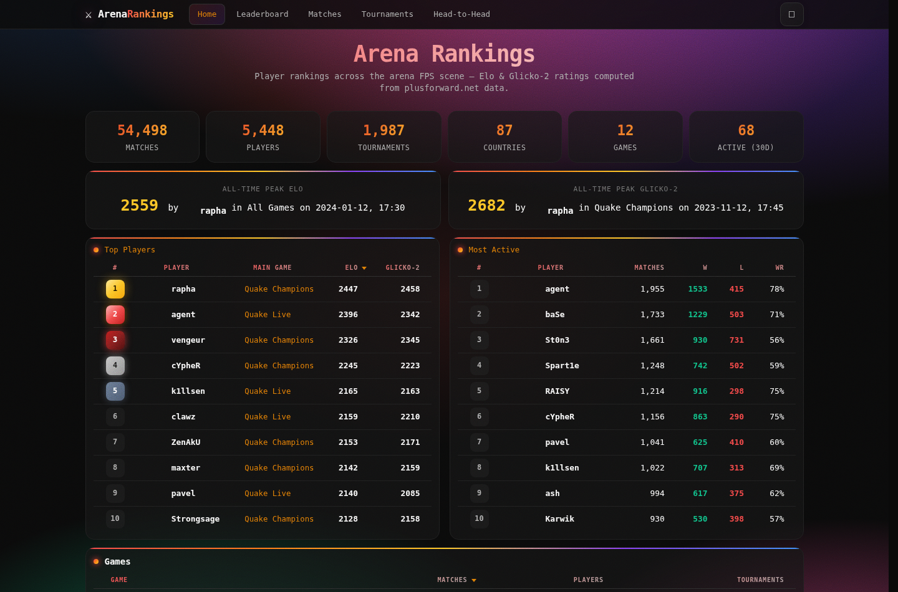
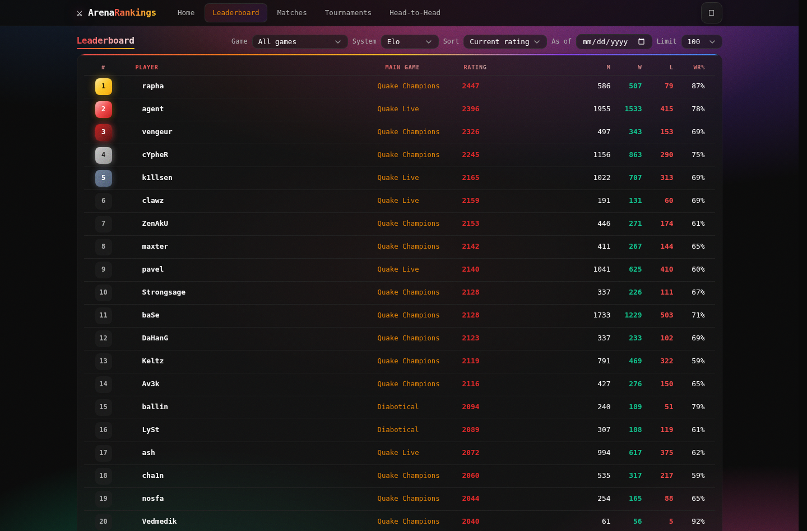
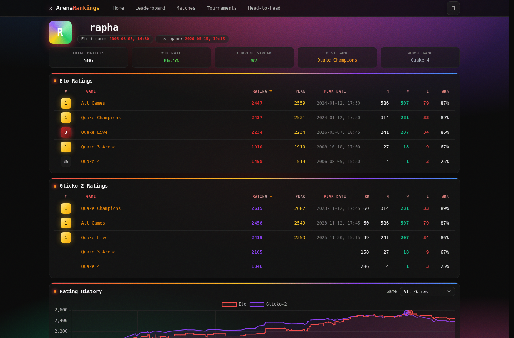
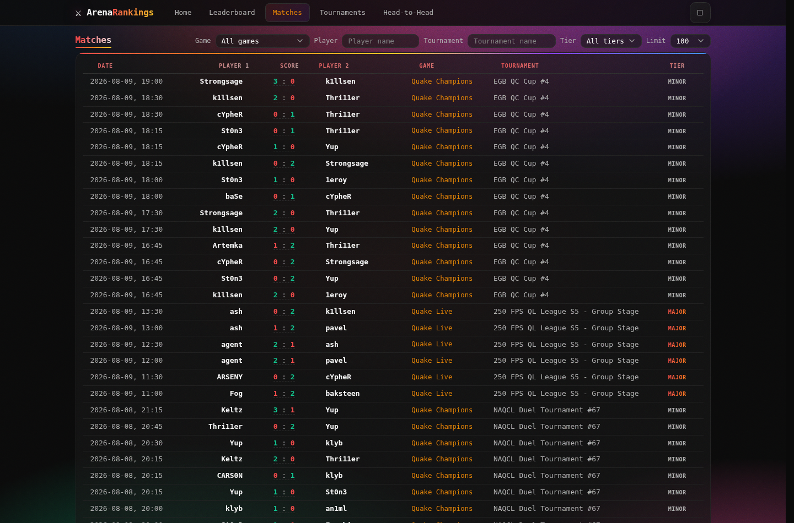
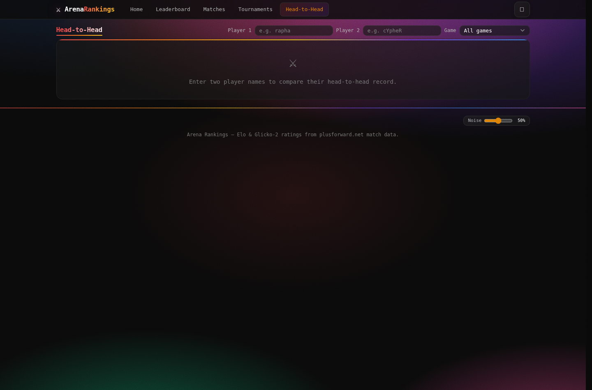
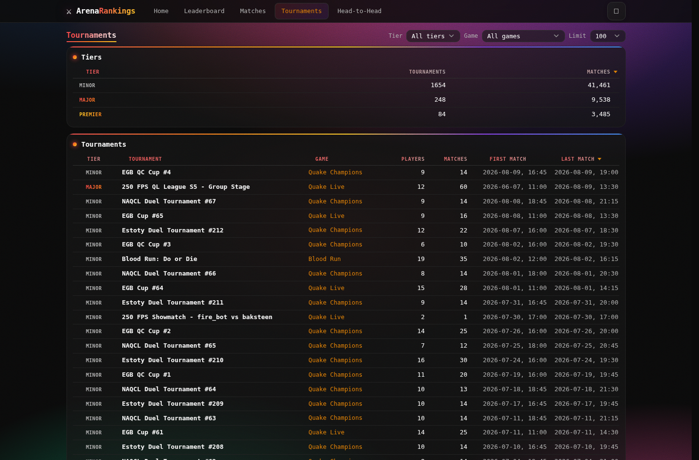

# Arena Rankings

Automated esports player rankings for the Quake Champions competitive scene. The project continuously discovers matches from [PlusForward](https://www.plusforward.net), downloads the match pages, parses them, and computes **Elo** and **Glicko-2** ratings that are served through a web site, a JSON API, and Discord/Twitch chat bots.

## Overview

Arena Rankings is a full data pipeline + front-end for competitive player ratings:

1. **Discovery** — scans the PlusForward matchlist and registers new matches.
2. **Download** — batch-downloads each match's HTML page.
3. **Parse** — extracts structured data (players, scores, maps, tournaments) from the HTML.
4. **Rank** — computes **Elo** and **Glicko-2** ratings from the parsed matches.
5. **Serve** — exposes the results via a web app, a JSON API, and Discord/Twitch bots.

All components are supervised by a daemon (`daemon.py`) that starts them in dependency order and restarts any that crash.

Data is stored in **ClickHouse**.

## Architecture

```
 PlusForward (matchlist + match pages)
        │
        ▼
 ┌─────────────┐   ┌──────────┐   ┌──────────┐   ┌────────────┐
 │  discovery  │──▶│ download │──▶│  parse   │──▶│    rank    │
 └─────────────┘   └──────────┘   └──────────┘   └────────────┘
        │               │               │               │
        └───────────────┴───────┬───────┴───────────────┘
                                ▼
                          ┌───────────┐
                          │ ClickHouse │
                          └───────────┘
                                │
          ┌─────────────────────┼──────────────────────┐
          ▼                     ▼                      ▼
     ┌─────────┐          ┌─────────┐           ┌──────────┐
     │  web    │          │ Discord │           │  Twitch  │
     │(FastAPI)│          │   bot   │           │   bot    │
     └─────────┘          └─────────┘           └──────────┘
```

- **Pipeline wrappers** (top-level scripts): `discovery.py`, `download.py`, `parse.py`, `rank.py`, `reset.py`.
- **Shared logic** lives in `src/`: match discovery/download/parsing, rankings computation, the database client/schema, the data provider (single query layer used by every consumer), and the bots/web app.
- **`cli.py`** provides a command-line interface into the same data.
- **`daemon.py`** supervises every component as a subprocess and forwards signals for graceful shutdown.

## Features

- **Two rating systems** — Elo (experience-aware K-factor × tournament tier multiplier) and Glicko-2 (with configurable rating period, tau, and volatility). Glicko-2 leaderboards/peaks use the conservative lower bound `rating − RD`.
- **Web app** (FastAPI + Jinja2): home page, leaderboards per game, player pages with rating-history charts, match pages, tournament pages, head-to-head (H2H) comparisons, and a JSON API at `/api/docs` (Swagger).
  - Day/night theme toggle, live table sorting/filtering, autocomplete search, smart match-mode detection for player filters.
- **Discord bot** — slash commands for rankings, player ratings, history, and H2H.
- **Twitch bot** — chat commands in one or multiple channels.
- **CLI** — `top`, `player`, `history`, `h2h`, `matches`, `player-matches`, `stats`, `games`, `tournaments`.
- **Daemon supervisor** — unified, aligned logging; crash-restart for every component.

## Requirements

- **Python 3.10+**
- **ClickHouse** running locally (default `localhost:9000`, database `arena_rankings`)
- **pip** packages: `clickhouse-driver`, `fastapi`, `uvicorn`, `jinja2`, `python-dotenv`, `discord.py` (optional, for the Discord bot), `python-socketio`/`requests` (as used by the Twitch bot).

> A `requirements.txt` is not currently committed — install the imports used by the modules you run.

## Setup

```bash
# 1. Install Python dependencies
pip install clickhouse-driver fastapi uvicorn jinja2 python-dotenv discord.py

# 2. Configure environment
cp .env.example .env
#   edit .env — set ClickHouse credentials and bot tokens (see Configuration)

# 3. Initialize the database schema
python -c "from src.db_client import Database; Database().init_schema()"
```

### Configuration

All settings come from environment variables (loaded from `.env` via `python-dotenv`):

| Variable | Default | Description |
|---|---|---|
| `CLICKHOUSE_HOST` / `PORT` / `DATABASE` | `localhost` / `9000` / `arena_rankings` | ClickHouse connection |
| `CLICKHOUSE_USER` / `PASSWORD` | `default` / `quakepass` | ClickHouse credentials |
| `DISCORD_BOT_TOKEN` | — | Discord bot token (required for the Discord bot) |
| `TWITCH_BOT_TOKEN` / `TWITCH_CHANNEL` / `TWITCH_NICKNAME` | — / — / `arenabot` | Twitch bot token, channels (comma-separated), nickname |
| `RATE_LIMIT_DELAY` | `0.0` | Delay (s) between HTTP requests |
| `HTTP_TIMEOUT` | `3` | Request timeout (s) |
| `DOWNLOADER_WORKERS` | `1` | Concurrent download workers |
| `PARSER_WORKERS` | CPU count | Concurrent parser threads |
| `MIN_MATCHES_ELO` / `MIN_MATCHES_GLICKO2` | `0` / `30` | Minimum matches before a player appears |
| `GLICKO2_PERIOD` | `month` | Rating period: `year` / `month` / `week` / `day` |
| `GLICKO2_TAU` | `1.2` | Glicko-2 system constant (0.2 stable – 1.2 volatile) |
| `WEB_HOST` / `WEB_PORT` | `0.0.0.0` / `8080` | Web server bind address/port |

See `config.py` for the full list, including the Elo K-factor table and tournament tier multipliers.

## Usage

### Run the full pipeline (daemon)

```bash
python daemon.py                 # run all components (supervised)
python daemon.py --no-discord    # skip the Discord bot
python daemon.py --workers 3     # download workers
python daemon.py -v              # verbose logging
```

### Run components individually

```bash
python discovery.py --daemon          # scan PlusForward matchlist
python download.py --workers 3        # download match pages
python parse.py --workers 4           # parse HTML -> ClickHouse
python rank.py --reset                # full recompute of ratings
python api_web.py --port 8080         # web site + JSON API
python bot_discord.py                 # Discord bot
python bot_twitch.py --channel chan1  # Twitch bot
```

Every wrapper supports `--daemon` (loop forever with restart delay), `--delay N`, and `-v`.

### CLI queries

```bash
python cli.py top --game "Quake Champions" --system glicko2 --limit 10
python cli.py player rapha
python cli.py history rapha --system elo
python cli.py h2h rapha "Agent 3K" --game "Quake Champions"
python cli.py matches --limit 20
python cli.py stats
python cli.py games
python cli.py tournaments
```

### Reset / reinitialize data

```bash
python reset.py rankings         # clear ratings + history (recomputed next cycle)
python reset.py parsed           # clear parsed data, reset status to 'discovered'
python reset.py all              # drop + recreate database
python reset.py --dry-run all    # preview what would be reset
```

`reset.py` stops and restarts the daemon automatically if it was running.

### systemd (optional)

A `systemd` unit (`arena-rankings.service`) is included to run the daemon as a service:

```bash
sudo cp arena-rankings.service /etc/systemd/system/
sudo systemctl daemon-reload
sudo systemctl enable --now arena-rankings
```

## Web app

Run `python api_web.py` and open `http://localhost:8080`.

- **Home** — top players across games with a period filter.
- **Leaderboard** — per-game rankings, sortable, with inline filters (Elo / Glicko-2, tier, rating range).
- **Player pages** — all ratings and a rating-history chart (`/player/{id}/{name}`).
- **Matches / Tournament pages** — match details, map results, tournament metadata and rankings.
- **H2H** — head-to-head comparison between two players.
- **JSON API** — interactive docs at `/api/docs` (endpoints under `/api/...`).

## Screenshots

Screenshots of the running app in its default **dark** theme (toggle to light via the header button).













## Project layout

```
arena-rankings/
├── cli.py                  # command-line interface
├── config.py               # all configuration (env-driven)
├── daemon.py               # supervisor: runs/restarts all components
├── discovery.py            # match discovery wrapper
├── download.py             # match download wrapper
├── parse.py                # match parsing wrapper
├── rank.py                 # rankings computation wrapper
├── reset.py                # database reset tool
├── api_web.py              # web server wrapper
├── bot_discord.py          # Discord bot wrapper
├── bot_twitch.py           # Twitch bot wrapper
├── src/
│   ├── db_client.py        # ClickHouse client
│   ├── db_schema.py        # DDL schema
│   ├── data_provider.py    # shared query layer (CLI/bots/web)
│   ├── match_discovery.py  # PlusForward matchlist scanning
│   ├── match_downloader.py # batch HTML downloader
│   ├── match_parser.py     # HTML -> structured data
│   ├── tournament_resolver.py
│   ├── rankings_compute.py # Elo + Glicko-2 computation
│   ├── api_web.py          # FastAPI app + routes
│   ├── bot_discord.py      # Discord slash commands
│   ├── bot_twitch.py       # Twitch chat commands
│   ├── table.py            # ASCII/table formatting
│   ├── web_templates/      # Jinja2 templates
│   └── web_static/         # CSS, JS, chart library
├── scripts/                # one-off backfill utilities
└── tests/                  # JS tests for the web UI
```

## Tests

`tests/` contains JS tests for the web UI (e.g. autocomplete, chart axes, tier sorting). Run them with a JS test runner of your choice against the static assets in `src/web_static/`.

## License

Not specified. Reach out to the maintainer for licensing terms.
